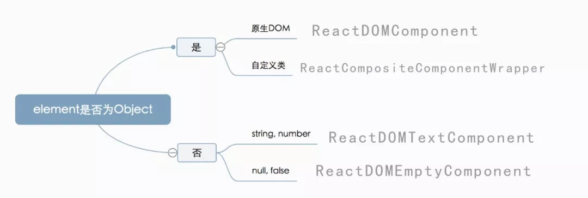
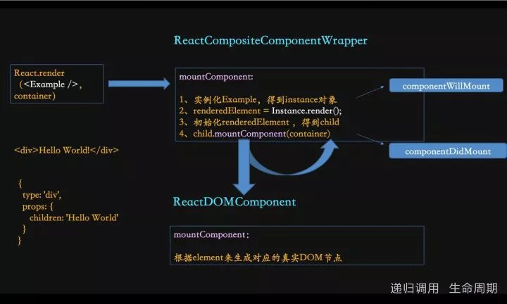
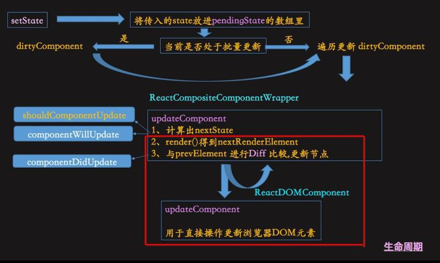
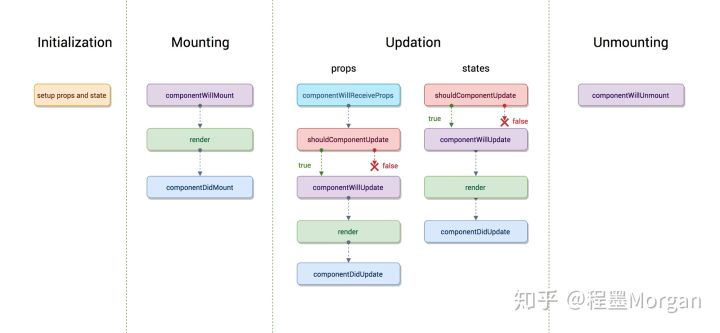
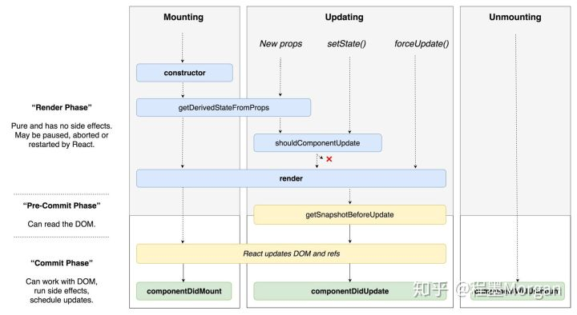

# **React基础**
## ***1.JSX***
在React中我们使用如下的语法来创建React元素
```
React.createElement(
  type, // html标签名字符串或React自定义组件（class组件或函数组件）
  [props],
  [...children]
)
```
为了避免冗长的输入，*React.createElement*方法又被简称为*JSX*，一种*Javascript*的扩展，允许用户使用类似HTML的语法定义React元素。所以本质上讲，JSX是一种语法糖，这种语法对语言的功能并没有影响，但是更方便程序员使用。

```
// 使用JSX
var esca = <a href='https://baidu.com'><span>5&gt;3{true && '--this is true'}</span></a>

ReactDOM.render(
  esca,
  document.getElementById('root')
);

// 使用React.createElement(Babel输出)
var esca = React.createElement(
  'a',
  { href: 'https://baidu.com' },
  React.createElement(
    'span',
    null,
    '5>3 ',
    true && '$gt;this is true'
  )
);
```
同时，React 认为渲染逻辑本质上与其他 UI 逻辑内在耦合，比如，在 UI 中需要绑定处理事件、在某些时刻状态发生变化时需要通知到 UI，以及需要在 UI 中展示准备好的数据。  
React 并没有采用将标记与逻辑进行分离到不同文件这种人为地分离方式，而是通过将二者共同存放在称之为“组件”的松散耦合单元之中，来实现**关注点分离**。所以，在React中建议大家使用JSX。

**关于关注点分离**
如果一个问题能分解为独立且较小的问题，就是相对较易解决的。问题太过于复杂，要解决问题需要关注的点太多，而程序员的能力是有限的，不能同时关注于问题的各个方面。（高内聚，低耦合）
针对前端开发的关注点分离来说，经历了以下三个阶段：  
1.非侵入式Javascript  
非侵入式Javascript就是说HTML标签中不嵌入任何javascript代码。HTML是纯HTML, Javascript也是纯Javascript。代表就是Jquery。
这种思想的问题在于，我们怎么告知两者的互联关系呢? 答案是: 除非看完Javascript的每行代码，否则不能确定两者关系是啥。严格的HTML和JS的分离，实际上导致应用难于维护调试。每当修改标签行的时候，必须考虑是否破坏某个jQuery选择器。也许放宽对关注分离的信仰，我们也许会可能会减轻一些痛苦吧。
2.双向绑定  
当数据改变的时候，UI就更新。当UI改变的时候，数据也随之改变。  
通过添加额外专门的标签，让HTML更加强大。这些标签实际上被解析为Javascript。我们最终非常舒服的将JS和HTML以此方式混合。代表就是Angular。
但这里我们实际上在HTML中放入了Javascript。这就不符合关注点分离的理念。  
3.JSX  
作为一个行业，我们已经确定(有共识):HTML和Javascript是胞兄胞弟。
诚然，我们只是没有大声说出来而已。但是对Angular, Knockout和Ember的拥抱，让我们新的偏好更明确。上面已经确定，在HTML中写入数据绑定是一种有效的将JS注入HTML的方式。但是我们要混合，
为什么选择加强一个像HTML一样软弱涣散的技术呢。
Facebook认为Javascript是更加合适的处理这两种混合关系的逻辑和强大技术。  
**JSX的优势**
1. 编译时错误(Compile-time Errors)得到快速反馈
2. 完全利用Javascript的强大功能，避免学习另外一种专属声明循环和条件语句方式的开销  

正如多数的进化形式，它是一种明智的改进。  
JSX isn’t revolutionary. It’s evolutionary.


**与HTML语法的区分**：  
1.由于JSX更贴近JS，故属性的key建议使用驼峰法写法，由于class在javascript中属于保留字，所以在React中添加class时使用className属性。  
2.可以在标签中添加属性，属性值若是字符串，则加上引号，若是对象或表达式，则加上{}. ""与{}不能混用。由于JSX更贴近JS。

## ***元素渲染***
**元素是构成 React 应用的最小砖块。**

元素描述了你在屏幕上想看到的内容。
```
// 根节点
<div id="root"></div>

const element = <h1>Hello, world</h1>;
ReactDOM.render(element, document.getElementById('root'));
```
仅使用 React 构建的应用通常只有单一的根 DOM 节点。如果你在将 React 集成进一个已有应用，那么你可以在应用中包含任意多的独立根 DOM 节点。  
React 元素是不可变对象。一旦被创建，你就无法更改它的子元素或者属性。一个元素就像电影的单帧：它代表了某个特定时刻的 UI。

根据我们已有的知识，更新 UI 唯一的方式是创建一个全新的元素，并将其传入 ReactDOM.render()。  

React DOM 会将元素和它的子元素与它们之前的状态进行比较，并只会进行必要的更新来使 DOM 达到预期的状态。
```
function tick() {
  const element = (
    <div>
      <h1>Hello, world!</h1>
      <h2>It is {new Date().toLocaleTimeString()}.</h2>
    </div>
  );
  ReactDOM.render(element, document.getElementById('root'));
}

setInterval(tick, 1000);
```

### **React首次渲染的逻辑**  
JSX -> element -> 真实DOM节点  
1.JSX代码经过babel编译之后变成React.createElement的表达式，这个表达式在render函数被调用的时候执行生成一个element。
```
{
  type: 'div',
    props: {
      className: 'cn',
        children: [
          {
            // React Component - 自定义组件
            type: function Header,
            props: {
                children: 'Hello, This is React'
            }
          },
          {
            // 原生DOM节点
            type: 'div',
            props: {
                children: 'start to learn right now！'
            }
          },
          // string
          'Right Reserve'
          // 除此之外还有两种类型
          // fale ,null, undefined,number
          // 数组 - 使用map方法的时候
      ]
  }
}
```
2.在**首次渲染**的时候，先去按照规则初始化element，接着ReactComponentComponentWrapper通过递归，最终调用ReactDOMComponent的mountComponent方法来帮助生成真实DOM节点。




## ***组件***
一个有效的 React 组件本质上就是 JavaScript 函数，它接收唯一带有数据的 “props”（代表属性）对象与并返回一个 React 元素。  
从定义方式上讲，分为函数组件和class组件，它们在React里是等效的。
```
// 函数组件
function Welcome(props) {
  return <h1>Hello, {props.name}</h1>;
}
// class组件
class Welcome extends React.Component {
  render() {
    return <h1>Hello, {this.props.name}</h1>;
  }
}
```
从状态来分，可以分为有状态组件和无状态组件。  
有状态组件和无状态组件之间的本质区别是有无state属性。

**注意**  
**使用class 关键字创建的组件，有自己的私有数据（this.state）和生命周期函数；**

**使用function创建的组件，只有props，没有自己的私有数据和生命周期函数；**

### 组件的渲染过程
```
function Welcome(props) {
  return <h1>Hello, {props.name}</h1>;
}

const element = <Welcome name="Sara" />;
ReactDOM.render(
  element,
  document.getElementById('root')
);
```
1.我们调用 ReactDOM.render() 函数，并传入 <Welcome name="Sara" /> 作为参数。  
2.React 调用 Welcome 组件，并将 {name: 'Sara'} 作为 props 传入。  
3.Welcome 组件将 ```<h1>Hello, Sara</h1>``` 元素作为返回值。  
4.React DOM 将 DOM 高效地更新为``` <h1>Hello, Sara</h1>```。

**注意： 组件名称必须以大写字母开头。  
React 会将以小写字母开头的组件视为原生 DOM 标签。例如，<div /> 代表 HTML 的 div 标签，而 <Welcome /> 则代表一个组件，并且需在作用域内使用 Welcome。**

**将函数组件转换成 class 组件**  
通过以下五步将 Clock 的函数组件转成 class 组件：

1.创建一个同名的 ES6 class，并且继承于 React.Component。  
2.添加一个空的 render() 方法。  
3.将函数体移动到 render() 方法之中。  
4.在 render() 方法中使用 this.props 替换 props。  
5.删除剩余的空函数声明。

## ***Props***
props是只读的.
```
function sum(a, b) {
  return a + b;
}
```
这样的函数被称为“纯函数”，因为该函数不会尝试更改入参，且多次调用下相同的入参始终返回相同的结果。

React 非常灵活，但它也有一个严格的规则：  
**所有 React 组件都必须像纯函数一样保护它们的 props 不被更改**。

## ***State***
在元素渲染章节中，我们只了解了一种更新 UI 界面的方法。通过调用 ReactDOM.render() 来修改我们想要渲染的元素。
实际上我们可以将函数组件转化为class组件，并向其中添加state来实现组件的自我更新。  
state 是私有的，并且完全受控于当前组件
```
class Clock extends React.Component {
  constructor(props) {
    super(props);
    this.state = {date: new Date()};
  }

  componentDidMount() {
    this.timerID = setInterval(
      () => this.tick(),
      1000
    );
  }

  componentWillUnmount() {
    clearInterval(this.timerID);
  }

  tick() {
    this.setState({
      date: new Date()
    });
  }

  render() {
    return (
      <div>
        <h1>Hello, world!</h1>
        <h2>It is {this.state.date.toLocaleTimeString()}.</h2>
      </div>
    );
  }
}

ReactDOM.render(
  <Clock />,
  document.getElementById('root')
);
```

让我们来快速概括一下发生了什么和这些方法的调用顺序：

1.当 <Clock /> 被传给 ReactDOM.render()的时候，React 会调用 Clock 组件的构造函数。因为 Clock 需要显示当前的时间，所以它会用一个包含当前时间的对象来初始化 this.state。我们会在之后更新 state。  
2.之后 React 会调用组件的 render() 方法。这就是 React 确定该在页面上展示什么的方式。然后 React 更新 DOM 来匹配 Clock 渲染的输出。  
3.当 Clock 的输出被插入到 DOM 中后，React 就会调用 ComponentDidMount() 生命周期方法。在这个方法中，Clock 组件向浏览器请求设置一个计时器来每秒调用一次组件的 tick() 方法。  
4.浏览器每秒都会调用一次 tick() 方法。 在这方法之中，Clock 组件会通过调用 setState()来计划进行一次 UI 更新。得益于 setState() 的调用，React 能够知道 state 已经改变了，然后会重新调用 render() 方法来确定页面上该显示什么。这一次，render() 方法中的 this.state.date 就不一样了，如此以来就会渲染输出更新过的时间。React 也会相应的更新 DOM。  
5.一旦 Clock 组件从 DOM 中被移除，React 就会调用 componentWillUnmount() 生命周期方法，这样计时器就停止了。

### 关于 setState() 你应该了解三件事：
1.不要直接修改 State，而是应该使用 setState()，构造函数是唯一可以给 this.state 赋值的地方  
2.State 的更新可能是异步的。出于性能考虑，React 可能会把多个 setState() 调用合并成一个调用。
因为 this.props 和 this.state 可能会异步更新，所以你不要依赖他们的值来更新下一个状态。  
3.State 的更新会被合并。当你调用 setState() 的时候，React 会把你提供的对象合并到当前的 state。这里的合并是浅合并。

**更新时渲染逻辑**


**单向数据流**  
组件可以选择把它的 state 作为 props 向下传递到它的子组件中。  

这通常会被叫做“自上而下”或是“单向”的数据流。任何的 state 总是所属于特定的组件，而且从该 state 派生的任何数据或 UI 只能影响树中“低于”它们的组件。

如果你把一个以组件构成的树想象成一个 props 的数据瀑布的话，那么每一个组件的 state 就像是在任意一点上给瀑布增加额外的水源，但是它只能向下流动。

## ***生命周期***

如果要开启async rendering，在render函数之前的所有函数，都有可能被执行多次。长期以来，原有的生命周期函数总是会诱惑开发者在render之前的生命周期函数做一些动作，现在这些动作还放在这些函数中的话，有可能会被调用多次，这肯定不是你想要的结果。  
原始React V16.3版本引入了新的API，
用一个静态函数getDerivedStateFromProps来取代被deprecate的几个生命周期函数，就是强制开发者在render之前只做无副作用的操作，而且能做的操作局限在根据props和state决定新的state

## ***事件处理***
React 元素的事件处理和 DOM 元素的很相似，但是有一点语法上的不同：

* React 事件的命名采用小驼峰式（camelCase），而不是纯小写。  
* 使用 JSX 语法时你需要传入一个函数作为事件处理函数，而不是一个字符串。
```
// 传统的 HTML
<button onclick="activateLasers()">
  Activate Lasers
</button>

// React
<button onClick={activateLasers}>
  Activate Lasers
</button>
```
* 不能通过返回 false 的方式阻止默认行为。你必须显式的使用 preventDefault
```
// 传统的 HTML
<a href="#" onclick="console.log('The link was clicked.'); return false">
  Click me
</a>
<a href="#" onclick="console.log('The link was clicked.'); return false">
  Click me
</a>

// React
function ActionLink() {
  function handleClick(e) {
    e.preventDefault();
    console.log('The link was clicked.');
  }

  return (
    <a href="#" onClick={handleClick}>
      Click me
    </a>
  );
}
```

**向事件处理程序传递参数**
```
// 箭头函数
<button onClick={(e) => this.deleteRow(id, e)}>Delete Row</button>
// Function.prototype.bind
<button onClick={this.deleteRow.bind(this, id)}>Delete Row</button>
```
上述两种方式是等价的,在这两种情况下，React 的事件对象 e 会被作为第二个参数传递。如果通过箭头函数的方式，事件对象必须显式的进行传递，而通过 bind 的方式，事件对象以及更多的参数将会被隐式的进行传递。


## 快速搭建
```
npx create-react-app my-app
cd my-app
npm start
```
